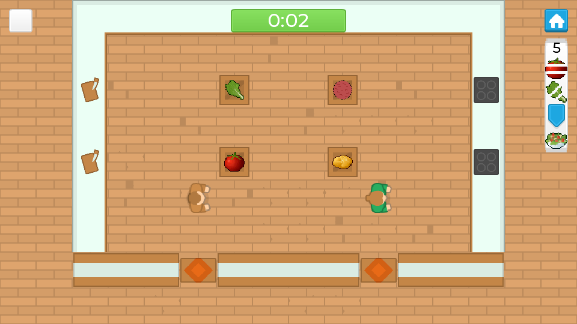
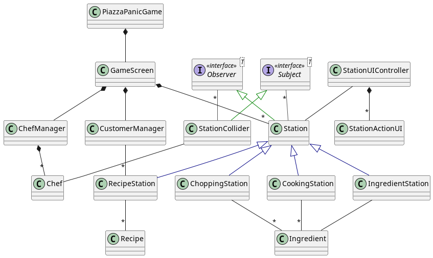
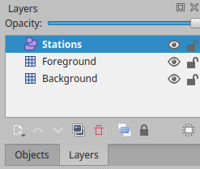
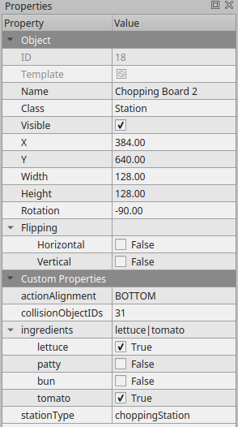

# Piazza Panic



## Running Requirements

When running the standalone JAR, you only need the following:

- Java JRE 11

## Development Requirements

When developing the game further, you will need these:

- Java JDK 11
- Tiled - [https://www.mapeditor.org/]()
- IntelliJ IDEA - [https://www.jetbrains.com/idea/]() (optional)

## Building and Running

To run the source code from the root directory, run this command:

```shell
./gradlew run
```

To build into a JAR file to run on desktop, run this command:

```shell
./gradlew desktop:dist
```

The resulting jar file will be in this folder: `desktop/build/libs/desktop-1.0.jar`.
Here is the latest [desktop-1.0.jar](desktop/build/libs/desktop-1.0.jar) on the `main` branch.

> Building and running the game can also be directly done through your IDE such as through IntelliJ
> IDEA.

## Libraries and Assets Used

### Code libraries and tools

- [Gradle](https://gradle.org/) - The build tool to simplify linking libraries, compilation and
  running the game.
- [libGDX](https://libgdx.com/) - The game engine which provides utilities to simplify game
  development and rendering.
- [Gdx freetype](https://libgdx.com/wiki/extensions/gdx-freetype/) - An extension to LibGDX to
  convert TTF fonts to BitMap fonts which are needed to display text.

### Assets

- [Kenney Assets](https://kenney.nl/) - (CC0) Tiles for tilemap, chef sprites, audio (not currently
  used, but available to use), and fonts.
- [Montserrat font](https://www.fontspace.com/montserrat-font-f16544) - SIL Open Font License (OFL)
- [Glitch Food Assets](https://opengameart.org/content/cc0-food-icons) - CC0
- Original assets

## Documentation

### Classes



The classes that are core to development are explained below. Not all classes are documented here,
but further documentation is available in the JavaDocs.

- `PiazzaPanicGame` - the base class that manages all the screens and the asset managers.
- `GameScreen` - this is the base logic for when the game is running. It deals with rendering and
  instantiating the level. It reads the tilemap TMX file, displays the background, and instantiates
  the Stations and StationColliders from the "Station" layer.

#### UI

- `ButtonManager` - deals with loading and disposing images for clickable buttons and creates them
  when necessary.
- `FontManager` - it loads TTF fonts and converts them to BitMap fonts as necessary at different
  font
  sizes that can be fetched when needed.
- `UIOverlay` - the HUD while playing the game which shows details of the current game state
  including
  the currently requested order, the currently selected chef, and the stack of ingredients that the
  chef has.
- `StationUIController` - the intermediary class that lies between stations and their corresponding
  UI
  for interaction.

#### Stations

- `Station` - the basis upon which all the stations are based. It extends Actor from libGDX and
  deals
  with rendering and interaction with StationColliders. To create a new station, one should create
  a new class extending this one and override the `act(float delta)`, `getActionTypes()`, and
  `doStationAction(StationAction action)` methods and the constructor to define the specifics of the
  new station.
- `StationCollider` - this is also an actor which has bounds so that whenever the chef walks over
  it,
  it notifies the subscribed Stations through the Observer pattern which chef is nearby so that the
  station can show its actions.
- `RecipeStation` - this takes a bunch of ingredients, decides what recipe can be made, creates it
  and
  submits it to fulfill an order.

#### Observable

- `Observer` - the interface which can be notified of updates from a class which implements Subject.
- `Subject` - the interface which has a data stream which notifies subscribed classes that implement
  Observer whenever the data is updated.

#### Food

- `Ingredient` - the basis for an ingredient that can be held in the Chef's stack. It has a String
  type and can be extended, and it contains the current state of cooking/chopping/etc.
- `Recipe` - the basis for a final recipe that can be created. It has a type, and that type can be
  used to identify which ingredients are necessary.
- `CustomerManager` - it creates the scenario of what recipe orders are requested by customers. It
  interacts with RecipeStations to know when recipes are completed.
- `FoodTextureManager` - this shares textures between ingredients and recipes of the same type.

#### Chef

- `Chef` - this is the chef itself which deals with carrying ingredients around, taking user input,
  and dealing with collision with the environment.
- `ChefManager` - this creates all the chefs and allows changing which chef is selected.

### Game Map

To update the game map and the layout, we are using [Tiled](http://www.mapeditor.org).</br>
The format of the map is TMX and consists of 3 layers:

- Stations - Object Layer
- Foreground - Tile Layer
- Background - Tile Layer



The Background layer is purely for visual purposes and has no effect on gameplay.

The Foreground layer is for collision that defines where the chef can or cannot go.

The Stations layer is where all the Stations and StationColliders are defined. The formats are
defined as follows:

- Station
    1. Select the Insert Tile tool, select the tile that you want the station to look like and place
       it on the map.
    2. Set the "Class" property to "Station"
    3. Set "actionAlignment" to where you want the action buttons and progress bars to show up.
    4. Set "collisionObjectIDs" to a comma separated list of the ids of the station colliders.
    5. Select the ingredients that can be used on the station. Depending on the station there may
       not be any, or there may be a maximum of one.
    6. Finally select the type of station it should be from the enum.

- StationCollider
    1. Select the Insert Rectangle tool and place it where you want the chef to go to interact with
       a station.
    2. Add the ID to the "collisionObjectIDs" of the corresponding stations that you want it to
       interact with.



All of this setup allows the code to automatically instantiate the stations in the correct positions
with their corresponding textures and station colliders.

To add a new type of station to the tile map, go to View->Custom Types Editor, select the
StationType enum, and add it there. You can also add possible ingredients here with the Ingredient
enum. The station properties can be edited here too.

### Additional Documentation

- [libGDX](https://libgdx.com/dev/)
- [Piazza Panic Documentation and JavaDoc](https://eng1-32.github.io/)
